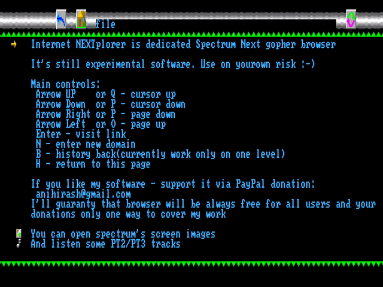

# Internet NEXTplorer

Gopher browser for ZX Spectrum Next and compatible computers.

## Development

To compile project all you need is [sjasmplus](https://github.com/z00m128/sjasmplus).

You may use or not use GNU Make. But for just build enought only sjasmplus: `sjasmplus --zxnext=cspect main.asm`

If you want run it in emulator - use CSpect with configured REAL ESP-module! Buildin ESP-emulator doesn't support all necessary commands. 

I've tried organize code for eaiser location all parts and wish you won't have issues with it. If there are some issues with it - feel free write me about it.

To bundle browser include `browser.nex` file and `docs/` directory in single package(should be placed in same directory).

## Usage

Before usage you should have already configured wifi chip(via wifi.bas/wifi2.bas located at demos/esp in Next distro).

Just download latest binary from releases page, extract file to Next's SD card and execute from browser NEX-file.

## Known issues

Font artifacts on file downloading. 

## Development plan
- [X] Publish first version and get first happy users
- [X] Fix history bugs
- [X] Make history multilevel
- [X] Add file downloads using proxy server
- [ ] Add mouse support
- [ ] Automatic change song to next(if it goes as next link on page)
- [ ] Same for screens
- [ ] Support more graphic formats?!
- [ ] Support more music formats?!

## Sponsorship

Github sponsorship isn't available for Russia.

You can support my work via PayPal(attached email written in [LICENSE file](LICENSE)).

Thank you.

## License

I've licensed project by [Nihirash's Coffeeware License](LICENSE).

Please respect it - it isn't hard.